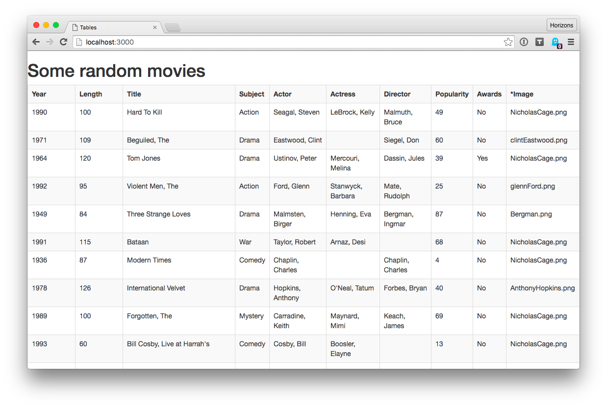

# Warmup Exercise: Tables

## Goal

The goal of this exercise is to get comfortable with converting 2-dimensional
arrays into HTML tables using templates.

## Instructions

Turn data stored in `data.json` into an HTML table using nested `{{#each}}`
loops.

1. There's a JSON file with 2-dimensional array data about some random movies
   in `data.json`. Check it out.
1. Update `index.hbs` to render data contained in `data.json` into tabular
   format. Note:
   - Contents of `data.json` are available in `index.hbs` as the variable
     `data`.
   - Use Handlebars `{{#each}}` directives to iterate over rows. Then
     inside each row iterate over columns by using `{{#each}}` again:

     ```
     {{#each data}}
       ROW
       {{#each this}} <!-- 'this' is current array item -->
         COLUMN
       {{/each}}
     {{/each}}
     ```

   - Each row should be inside a `<tr>` element.
   - Columns in the first row of should be rendered as table headers inside
     `<th>` elements.
   - Columns in the subsequent rows of should be rendered as table cells
     inside `<td>` elements.
   - `index.hbs` contains sample code for rendering tables in HTML. You can
     delete this code.

Sample correct output:


